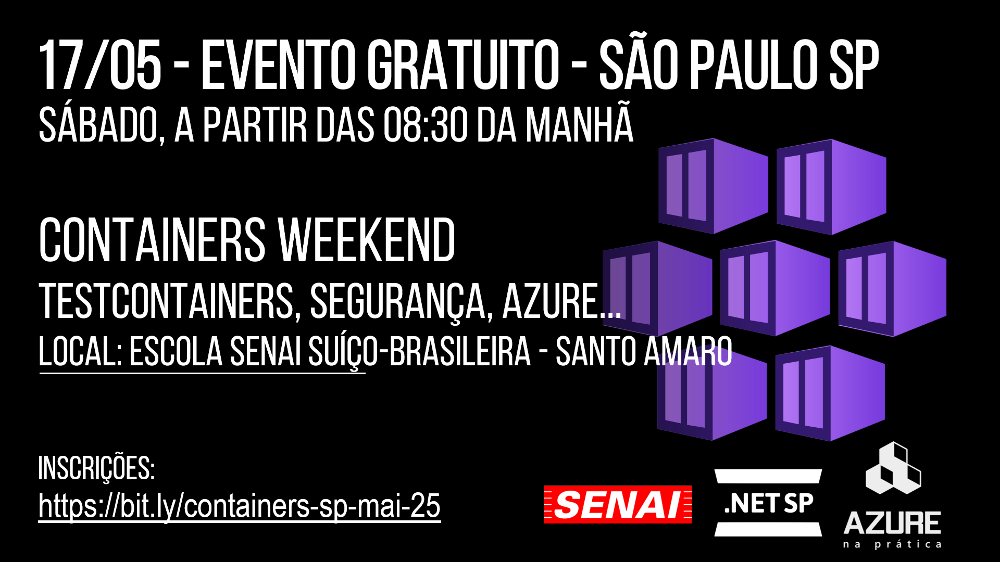

# ContainersWeekend-2025-05
Fotos e informações gerais sobre o evento "Containers Weekend ", realizado em 17/05/2025 na cidade de São Paulo-SP.

Organizadores:
- **Renato Groffe (Microsoft MVP, Docker Captain, MTAC)**
- **Atila Olivi (SENAI)**

Número de participantes: **65 pessoas**

Apresentação realizada durante o evento:
**Docker e Containerização: uma visão geral**

Tecnologias e tópicos abordados: **Docker, Containers, Docker Compose, Docker Desktop, Linux, Testcontainers, Docker Scout, Play with Docker, Microsoft Azure, .NET, ASP.NET Core, Java, Node.js, Kubernetes, DevSecOps, Mobile Security Framework, Cloud Native, Linux Foundation...**

Acesse este [**link**](/img/) para visualizar todas as fotos das apresentações.

Este evento foi uma parceria entre as comunidades [**.NET SP**](https://www.meetup.com/dotnet-Sao-Paulo/) e [**Azure na Prática**](https://www.youtube.com/azurenapratica), em conjunto com a [**Escola Senai Suíço-Brasileira Paulo Ernesto Tolle**](https://suicobrasileira.sp.senai.br/).

Formulário utilizado para inscrições: [**Sympla**](https://www.sympla.com.br/evento/devops-weekend-github-containers-certificacoes-gratuito-e-presencial-sao-paulo-sp/2834466)

Local: **Escola SENAI Suíço-Brasileira Paulo Ernesto Tolle - Rua Bento Branco de Andrade Filho, 379 - Santo Amaro - São Paulo/SP - CEP 04757-000**

Conteúdos utilizados durante a apresentação:
- https://github.com/renatogroffe/seguranca-containers_senai-2025-05
- https://github.com/renatogroffe/testcontainers_senai-2025-05

---

